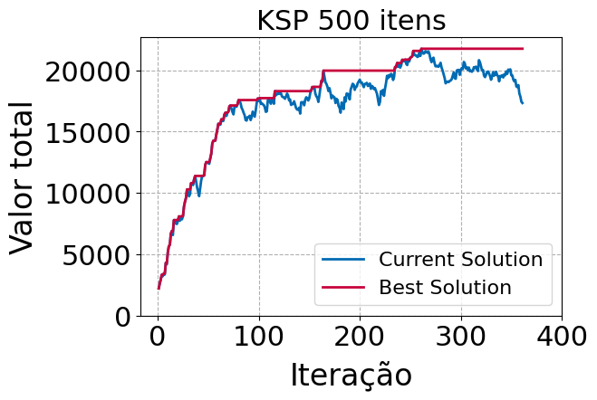

# KNP-TS
Tabu Search implementation for the Knapsack problem.

This repository contains the implementation for both, the TABU Search metaheurístic and the optimal approach to solve the Knapsack problem.

The instances used in this work, are adaptations of the instances found in this:

[http://artemisa.unicauca.edu.co/~johnyortega/instances_01_KP/](http://artemisa.unicauca.edu.co/~johnyortega/instances_01_KP/)

Also for the otimization model, it was considered the formulation found in the follow:

[https://personal.utdallas.edu/~scniu/OPRE-6201/documents/DP3-Knapsack.pdf](https://personal.utdallas.edu/~scniu/OPRE-6201/documents/DP3-Knapsack.pdf)

## SA Convergence
<table>
  <tr>
    <td></td>
    <td></td>
    <td></td>
  </tr>
</table>

## Comparison
<table>
  <tr>
    <td></td>
  </tr>
</table>